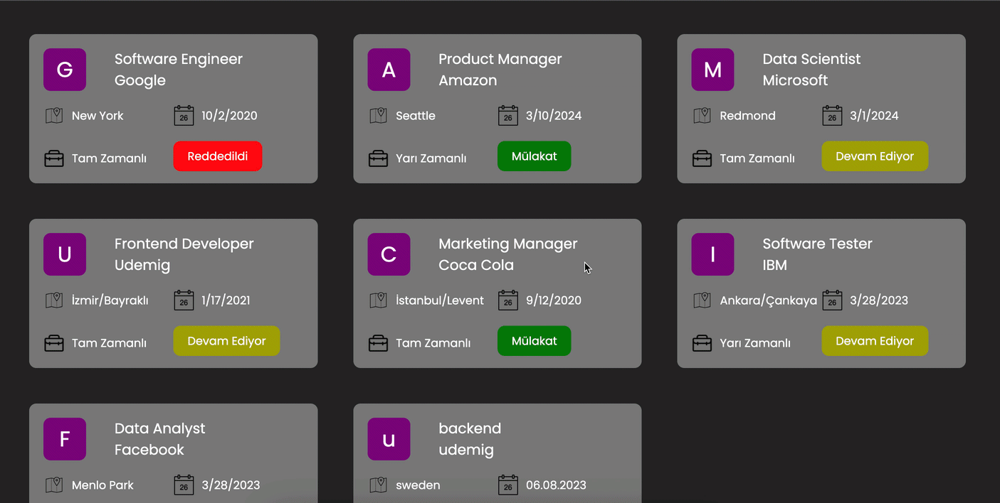

# Proje Gifi

# Kütüphaneler
- react-router-dom
- json-server
- @reduxjs/toolkit
- react-redux
- sass
- axios
- uuid
- react-toastify(kurulum için: https://fkhadra.github.io/react-toastify/installation)

# Yapılacaklar
- redux kurulumu yap (toolkit)
- react-router-dom kurulumu yap
- json-server kurulumu yap
- `localhost:3030/jobs` endpoint'ine istek at ve verileri store'a aktar
- `jobList.jsx` de store'a abone ol ve işleri listele